1.Get\_Start\_with\_ggplot
================
PK (Kasidit) Ratanavijai
10/5/2019

Note that this are my approach on ggplot. Hence, it contains my views
and comments. “ALL RIGHTS RESERVED”

``` r
library(dslabs)
data(murders)
library(dplyr)
```

    ## 
    ## Attaching package: 'dplyr'

    ## The following objects are masked from 'package:stats':
    ## 
    ##     filter, lag

    ## The following objects are masked from 'package:base':
    ## 
    ##     intersect, setdiff, setequal, union

## First of all you need library

1.ggplot2  
or  
2.tidyverse (will include ggplot)

``` r
library(ggplot2)
library(tidyverse)
```

    ## -- Attaching packages ------- tidyverse 1.2.1 --

    ## v tibble  2.1.3     v purrr   0.3.2
    ## v tidyr   1.0.0     v stringr 1.4.0
    ## v readr   1.3.1     v forcats 0.4.0

    ## -- Conflicts ---------- tidyverse_conflicts() --
    ## x dplyr::filter() masks stats::filter()
    ## x dplyr::lag()    masks stats::lag()

## Grammar of Graphics

**3 Components of ggplot2**

1.  Data  

<!-- end list -->

  - Data table that our plot based on

<!-- end list -->

2.  Geometry  

<!-- end list -->

  - Type of plots such as (barplot, histograms, scatter plot, etc.)  

<!-- end list -->

3.  Mapping  

<!-- end list -->

  - x-axis and y-axis mapping with data

**Data that we will work on**

``` r
# Total murder in United States by each States
str(murders)
```

    ## 'data.frame':    51 obs. of  5 variables:
    ##  $ state     : chr  "Alabama" "Alaska" "Arizona" "Arkansas" ...
    ##  $ abb       : chr  "AL" "AK" "AZ" "AR" ...
    ##  $ region    : Factor w/ 4 levels "Northeast","South",..: 2 4 4 2 4 4 1 2 2 2 ...
    ##  $ population: num  4779736 710231 6392017 2915918 37253956 ...
    ##  $ total     : num  135 19 232 93 1257 ...

``` r
head(murders)
```

    ##        state abb region population total
    ## 1    Alabama  AL  South    4779736   135
    ## 2     Alaska  AK   West     710231    19
    ## 3    Arizona  AZ   West    6392017   232
    ## 4   Arkansas  AR  South    2915918    93
    ## 5 California  CA   West   37253956  1257
    ## 6   Colorado  CO   West    5029196    65

**Createing a plot**

1.  Initiate data object

<!-- end list -->

``` r
ggplot (data = murders)
#or using pipe
Plot = murders %>% ggplot()
```

2.  Add layers

<!-- end list -->

  - Using “+” for adding new layers. For example, Data %\>% ggplot()
    +layer 1 + layer2 + …+ layer n  
  - First layer is type of plot. For example, geom\_point() for scatter
    plot and geom\_histogram() for histogram  
  - creating scatter plot using aes() to specify x-axis and
y-axis

<!-- end list -->

``` r
#in this case we want to see correlation between total population (x) and number of total murders (y)
m.plot = murders %>% ggplot(aes (x = population/10**6 , y = total)) +
  geom_point()
m.plot
```

<!-- -->

``` r
#then yo can add lable and text with geom_text(). Note that you can omit x and y*
m.plot +
  geom_text(aes (label = abb))
```

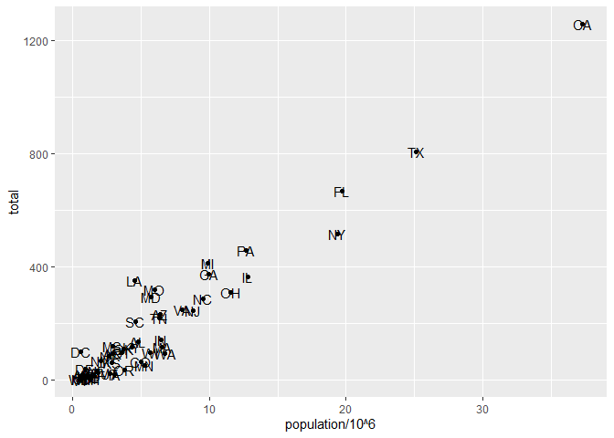<!-- -->

3.  Tinkering your plot

<!-- end list -->

  - You probably notice from our plot that abbs(state name) were
    difficult to read by stay behind those points  
  - Several ways to edit your point , texts and etc. Some sample can be
    found here.

<!-- end list -->

``` r
#Making point smaller with geom_point(aes(), "size")
m.plot + geom_point( size = 1)
```

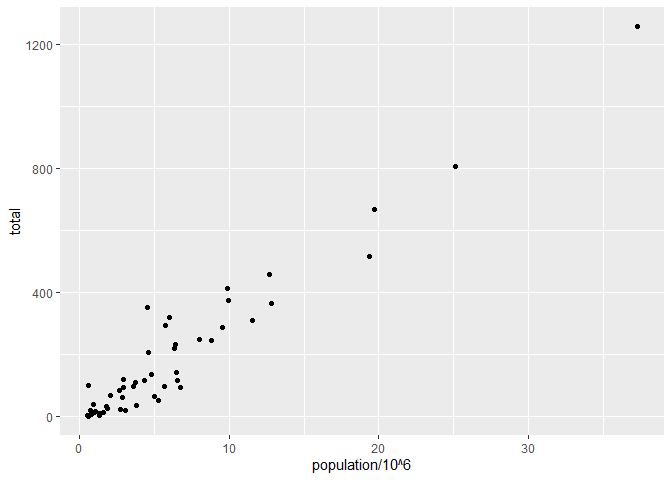<!-- -->

``` r
#move text to the left with geom_text(aes(), "nudge_x")
m.plot + geom_text(aes (label = abb), nudge_x = 1)  
```

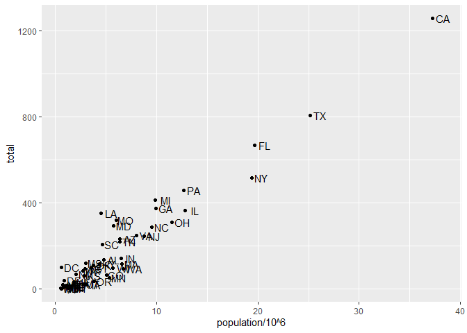<!-- -->

4.  Adjust scales, label and add color

<!-- end list -->

  - Adjust scales with log10 so we can better see the
correlation

<!-- end list -->

``` r
#use layer scale_x_continuous () and scale_y_continuous () to transform scales
m.plot + geom_point( size = 3) +
  scale_x_continuous (trans = "log10")+
  scale_y_continuous (trans = "log10") 
```

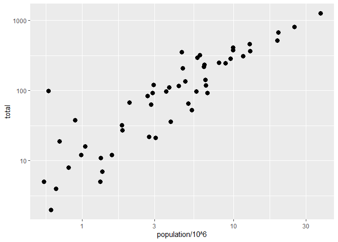<!-- -->

  - Add label for x-axis and y-axis with xlab() and ylab() and plot
    title with ggtitle()

<!-- end list -->

``` r
m.plot +
  xlab ("Population in millions") + 
  ylab ("Total number of murders") + 
  ggtitle("Gun murders in US 2010")
```

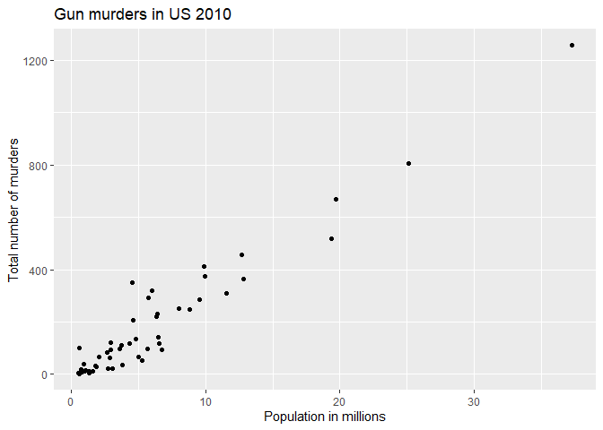<!-- -->

  - Change color of the points by color() in geom\_point()

<!-- end list -->

``` r
#Change all points color to blue
m.plot + geom_point(size = 3, color = "blue")
```

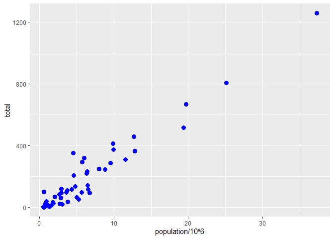<!-- -->

``` r
#You can catagorize color by each Regions
m.plot + geom_point(aes(col = region), size = 3)
```

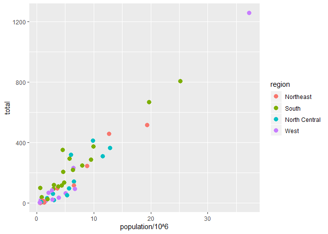<!-- -->

  - Add a average total murders rate line using geom\_abline()

<!-- end list -->

``` r
# Compute (r) a average total murders rate
r = murders %>%
  summarize(rate = sum(total) / sum(population) *10^6) %>% .$rate

# add (r) line to the plot with geom_abline()
m.plot + geom_point(aes (col = region) , size = 3) +
  scale_x_continuous (trans = "log10") +
  scale_y_continuous (trans = "log10") +
  #Note that lty change type of line and color change color of the line
  geom_abline(intercept = log10(r) , lty = 2, color = "darkgrey")
```

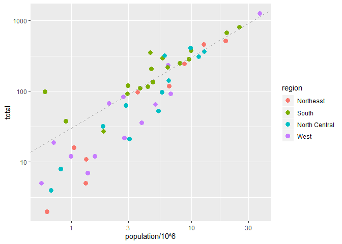<!-- -->

  - Another powerful package ggthemes and ggrepel that help implement
    new themes

<!-- end list -->

``` r
# Install package and apply selected theme on plot
library(ggthemes)
m.plot + theme_economist()
```

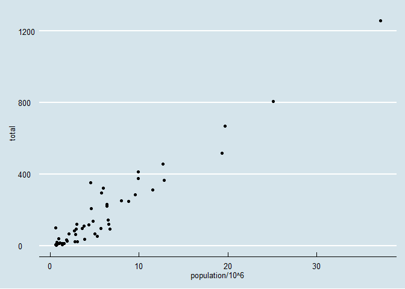<!-- -->

``` r
#ggrepel help move text around to be able to see clearly
library(ggrepel)
m.plot + geom_text_repel(aes (label =abb) )
```

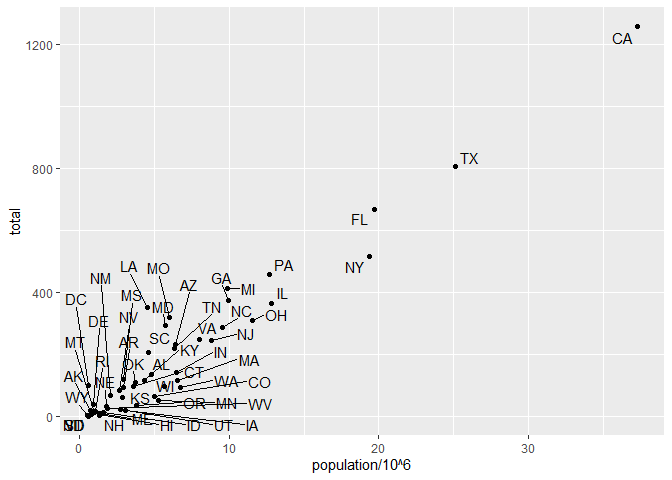<!-- -->

### Done\!\! Putting everything we learn all together. We get clearly visualization for the Murders date

``` r
#initiate data
murders %>% ggplot(aes (x = population/10^6 , y = total, label = abb)) + 
  #define type of plot
  geom_point(aes(col = region), size = 2) + 
  #add label for point
  geom_text_repel() + 
  #Change scale to log10
  scale_x_continuous (trans = "log10")+
  scale_y_continuous (trans = "log10")+
  #add x-axis and y-axis label , and Plot tile
  ggtitle("Gun Murders in United States in 2010") + 
  xlab("log10 of total population") + 
  ylab("log10 of total number of Murders") +
  # add (r) line to the plot with geom_abline()
  geom_abline(intercept = log10(r) , lty = 2) +
  #Add theme
  theme_economist()
```

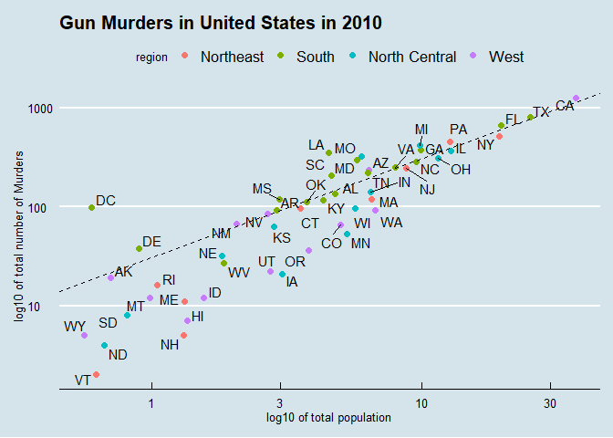<!-- -->

### Let Analyse this.

From the scatter plot we can see that

  - **Correlation**
      - total number of muders in the US has positive correlation with
        total population in the US  
      - States from South region has significant strong positive
        correlation between total number of muders and total population
  - **Region**
      - South region has the highest number of murders which reason
        might be because of their high population number
  - **States**
      - DC has significant high murders number that is not correlated
        with its population size  
      - CA has the highest murders number with the hightest population
        size
      - VT has the lowest murders number with the lowest population size

\*Thank you for all your effort going through this guide. If you have
any question or suggestion please feel free to contact me.
